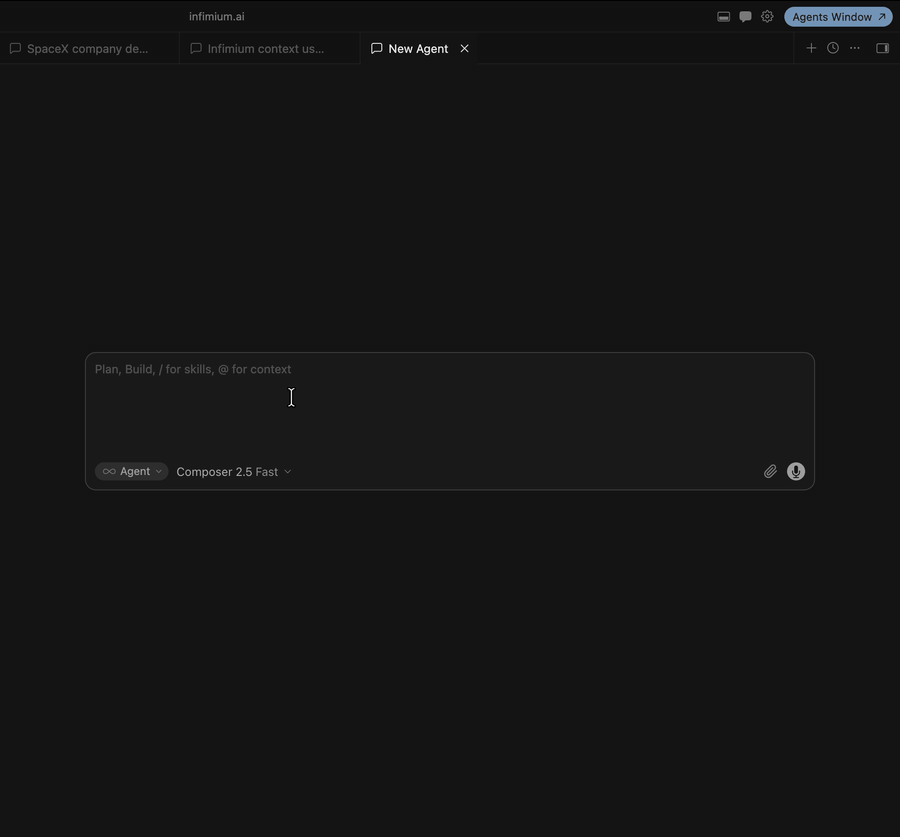

<p align="center">
  
</p>

# Infimium

Private context layer for AI coding agents. Search code and docs, inspect dependencies, preserve project memory, and build grounded plans from one local MCP server.

[](https://www.npmjs.com/package/infimium)
[](LICENSE)
[](https://github.com/infimium-ai/infimium-agent)

## Why

Large repositories make agents read too much code or miss the right symbol. Infimium retrieves compact, relevant context before the agent starts editing.

```text
200,000 lines of code
Agent reads everything -> context blown + expensive
grep "price calculation" -> misses calcPropertyValue()
```

```text
tool: semantic_code_search
query: "price calculation logic"

-> services/property/calc.ts:142 · calcPropertyValue()
-> callers: getListingPrice(), estimatePropertyTax()
```

## 1,460 Tokens -> 8

Infimium drops the initial payload cost from approximately **1,460 tokens to 8 tokens per symbol**. Semantic search returns the AST signature first; the agent requests the full implementation only when it needs it with `expand_symbol`.

```text
Full implementation   ~1,460 tokens
AST skeleton               ~8 tokens
Initial payload reduction  ~99.5%
```

These are Playground reference values, not a claim that every function has the same size. Inspect your own indexed repository and compare AST-first retrieval with full-text retrieval locally:

```bash
infimium playground
```

Open **Token Economics** to see the estimated token difference across your actual indexed symbols.

## Quick Start

Requires Node.js 22.5+ and [Ollama](https://ollama.com/).

```bash
npm install -g infimium
ollama serve
ollama pull nomic-embed-text
cd /path/to/your/project
infimium init
infimium index
infimium doctor
```

`infimium init` creates one global config at `~/.infimium/.env`. You do not need a `.env` in every project. Code, docs, memory, graphs, and vectors are stored locally under `~/.infimium/`.

Web search is optional. Add a Tinyfish key only when you need it:

```env
SEARCH_PROVIDER=tinyfish
SEARCH_API_KEY=your_key
```

Full `infimium plan` generation also needs a local text model:

```bash
ollama pull llama3.1
```

`infimium plan --dry-run "your task"` works without this model and shows the retrieved code context first.

## Connect Your Agent

Cursor, Windsurf, Claude Desktop, and other MCP clients:

```json
{
  "mcpServers": {
    "infimium": {
      "command": "npx",
      "args": ["-y", "infimium", "serve"]
    }
  }
}
```

Restart the client, then use:

```text
Use Infimium hello_infimium.
Use Infimium get_context before starting.
Use Infimium semantic_code_search to explain this repository.
```

Infimium normally uses the MCP process working directory. If your client starts it elsewhere, pass `project_path` once; Infimium remembers the active project and auto-indexes it.

## Tools

| Tool | What it does |
| --- | --- |
| `hello_infimium` | Confirms the MCP server is healthy. |
| `get_context` | Loads compact YAML project context, Git state, task, and memory. |
| `semantic_code_search` | Finds code by meaning and returns symbol signatures first. |
| `expand_symbol` | Loads one full implementation only when needed. |
| `query_local_docs` | Searches local Markdown, text, HTML, and PDF files. |
| `dep_graph` | Shows imports, callers, callees, and HTTP routes for a symbol. |
| `project_memory` | Saves progress, decisions, tasks, and blockers across agents. |
| `plan` | Builds a grounded implementation plan from code and graph context. |
| `web_search` | Searches the web through optional Tinyfish configuration. |
| `fetch_url` | Extracts readable Markdown or text from a URL. |
| `shell` | Runs allowlisted commands with timeouts and output limits. |

## CLI

```bash
infimium doctor
infimium status
infimium playground
infimium index
infimium watch
infimium get-context
infimium code-search "authentication middleware"
infimium expand-symbol authenticateUser
infimium docs-search "deployment setup"
infimium dep-graph authenticateUser
infimium plan --dry-run "add rate limiting"
infimium remember "Rate limiter tests pass" --type progress --task "Rate limiting"
infimium resume
```

Use `npx infimium ...` if you did not install the package globally.

From a source checkout, build once and run the local playground with:

```bash
npm run build
npm run playground
```

## Local Architecture

- Ollama creates embeddings on your machine.
- Embedded SQLite stores vectors, index metadata, project memory, and graph edges. No ChromaDB or Docker service is required.
- Documents use recursive boundary-aware chunks instead of blind fixed slices.
- JavaScript, TypeScript, Python, and Dart parsers are bundled.
- Go, Rust, and Java Tree-sitter WASM grammars download on first use and cache in `~/.infimium/grammars/`.
- `.gitignore`, `.infimiumignore`, and framework defaults exclude dependencies, build output, Flutter artifacts, caches, and binaries before indexing.
- `semantic_code_search` returns signatures; `expand_symbol` provides full code on demand.

## Multiple Projects

Run the normal index command from a folder containing related projects:

```bash
infimium index
```

Infimium detects immediate project roots from files such as `pubspec.yaml`, `package.json`, `Cargo.toml`, and `go.mod`. It shows the detected roles and dependencies, asks once, then creates `infimium.workspace.json`, indexes every project, and opens Playground.

For unattended setup:

```bash
infimium index --yes --no-playground
```

Use `--no-workspace` to index only the current project. Workspace projects keep separate memory and Git state while `get_context` includes compact summaries and graph relationships from related projects.

## Privacy

Code, docs, embeddings, memory, graph data, prompts, queries, file paths, and repo names remain local.

Infimium sends privacy-safe anonymous lifecycle telemetry so we can understand setup success:

- `init_started`, `init_completed`
- `doctor_run`, `doctor_passed`
- `index_started`, `index_completed`, `setup_completed`
- `serve_started`, `first_tool_call`, `playground_opened`

Telemetry includes an anonymous install ID, Infimium version, OS, Node major version, timestamp, and event name. It never includes code, file paths, repo names, prompts, search queries, memory notes, API keys, or user identity.

Disable it anytime:

```bash
infimium telemetry off
```

or set:

```env
INFIMIUM_TELEMETRY=false
```

## Troubleshooting

Run:

```bash
infimium doctor
```

Every failed check prints one copy-paste fix. If setup still fails, give this prompt to your coding agent:

```text
Set up Infimium in this repository. Install/start Ollama, pull nomic-embed-text,
run npx infimium init, run npx infimium index, and make all six
npx infimium doctor checks pass. Do not commit secrets.
```

## Demo

[](docs/assets/infimium-demo.mp4)

## Contributing

See [CONTRIBUTING.md](CONTRIBUTING.md). Adding a language starts with a parser fixture and extraction test.

Self-hosting is free forever under the MIT license.
