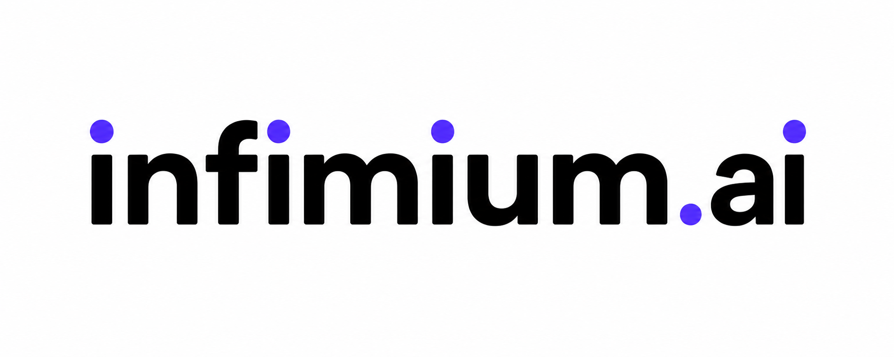

<p align="center">
  
</p>

# Infimium

Private search MCP for AI agents. Web · code · local docs · dependency graph — one endpoint, your machine.

[](https://www.npmjs.com/package/infimium)
[](LICENSE)
[](https://github.com/infimium/infimium)

## The problem

Agents need precise context, but large repos make that expensive fast.
Keyword search is brittle: it misses intent, aliases, and the symbols that actually matter.

```
200,000 lines of code
Agent reads everything → 💀 context blown + $$$
grep "price calculation" → misses calcPropertyValue()
```

## With Infimium

Infimium indexes your docs, code symbols, and dependency graph locally.
Agents ask focused tools for the right context instead of reading the whole project.

```
tool: semantic_code_search
query: "price calculation logic"

→ services/property/calc.ts:142 · calcPropertyValue()
→ imported by: listing.ts, tax.ts, pdf-generator.ts, calc.test.ts
```

## Tools

`web_search` — Brave web search with retry and concise source snippets.

`fetch_url` — fetches HTML, strips noise, returns Markdown or text.

`query_local_docs` — local document RAG over `.md`, `.txt`, `.html`, and `.pdf`.

`semantic_code_search` — differentiator: tree-sitter symbols + local embeddings for meaning-based code search.

`dep_graph` — differentiator: SQLite import graph for "where is this defined and who imports it?"

`shell` — allowlisted command runner with blocked patterns, timeout, and output caps.

`status` — CLI health check for indexed docs, code symbols, dep graph relationships, watched projects, DB size, and last index time.

`plan` — paid preview: scans changed projects, disambiguates, writes `plan.md`, hands it to Cursor or Claude Code.

## Why self-hosted

Your code index, your embeddings, your dep graph — all on your machine. Nothing leaves.

- Embeddings run locally with Ollama.
- No vendor lock-in: MCP, SQLite, ChromaDB, TypeScript.
- Works in air-gapped environments.

## Quick start

```bash
git clone https://github.com/infimium/infimium && cd infimium
cp .env.example .env  # add your SEARCH_API_KEY
./scripts/setup.sh
```

## Setup guide

### Docker

```bash
cp .env.example .env
```

Set:

```bash
SEARCH_API_KEY=...
LOCAL_DOCS_PATH=./docs
CODEBASE_PATH=./code
```

Run:

```bash
./scripts/setup.sh
```

The setup script starts ChromaDB, starts Infimium, pulls `nomic-embed-text`, runs indexing, and prints the MCP config.

### Local development

Install dependencies:

```bash
npm install
```

Requires Node.js 22.5+.

Start Ollama:

```bash
ollama serve
ollama pull nomic-embed-text
```

Start ChromaDB on `http://localhost:8000`.

Create `.env`:

```bash
cp .env.example .env
```

Use local paths:

```bash
LOCAL_DOCS_PATH=/absolute/path/to/docs
CODEBASE_PATH=/absolute/path/to/code
OLLAMA_HOST=http://localhost:11434
CHROMADB_HOST=http://localhost:8000
```

Index:

```bash
npm run index
```

Serve:

```bash
npm start -- serve
```

Check status:

```bash
npm run status
```

## Tool brief

| Tool | Input | Requires | Output |
| --- | --- | --- | --- |
| `web_search` | `query`, `max_results` | Brave API key | ranked web results |
| `fetch_url` | `url`, `extract` | network access | cleaned Markdown/text |
| `query_local_docs` | `query`, `top_k` | indexed docs, Ollama, ChromaDB | matching document chunks |
| `semantic_code_search` | `query`, `language`, `top_k` | indexed code, Ollama, ChromaDB | matching symbols with file and line range |
| `dep_graph` | `symbol_name` | indexed code graph | definition file, importers, imports |
| `shell` | `command`, `cwd`, `timeout` | allowlisted command | stdout, stderr, exit code |
| `status` | none | local SQLite/ChromaDB state | index health summary |

## Use the tools

After adding Infimium to Claude Desktop, Cursor, or Windsurf, ask the agent to use a specific Infimium tool by name. The MCP client sends the JSON input to Infimium; you do not call these tools with HTTP.

### `web_search`

Use it for current web results.

Prompt:

```text
Use Infimium web_search to find recent MCP server examples.
```

Tool input:

```json
{
  "query": "recent MCP server examples",
  "max_results": 5
}
```

Requires:

```bash
SEARCH_API_KEY=...
SEARCH_PROVIDER=brave
```

### `fetch_url`

Use it to fetch a page and extract readable content.

Prompt:

```text
Use Infimium fetch_url to fetch https://modelcontextprotocol.io and summarize it.
```

Tool input:

```json
{
  "url": "https://modelcontextprotocol.io",
  "extract": "markdown"
}
```

`extract` can be `markdown` or `text`.

### `query_local_docs`

Use it after indexing local documents.

Prompt:

```text
Use Infimium query_local_docs to find setup instructions for ChromaDB.
```

Tool input:

```json
{
  "query": "ChromaDB setup instructions",
  "top_k": 5
}
```

Before using:

```bash
LOCAL_DOCS_PATH=/absolute/path/to/docs
npm run index
```

### `semantic_code_search`

Use it to find code by meaning instead of exact text.

Prompt:

```text
Use Infimium semantic_code_search to find the price calculation logic.
```

Tool input:

```json
{
  "query": "price calculation logic",
  "language": "typescript",
  "top_k": 5
}
```

Before using:

```bash
CODEBASE_PATH=/absolute/path/to/code
npm run index
```

`language` is optional. Supported values depend on indexed files: `javascript`, `typescript`, `python`.

### `dep_graph`

Use it to see where a symbol is defined, who imports it, and what its file imports.

Prompt:

```text
Use Infimium dep_graph for calcPropertyValue.
```

Tool input:

```json
{
  "symbol_name": "calcPropertyValue"
}
```

Before using:

```bash
CODEBASE_PATH=/absolute/path/to/code
npm run index
```

### `shell`

Use it for safe, allowlisted local commands.

Prompt:

```text
Use Infimium shell to run git status.
```

Tool input:

```json
{
  "command": "git status",
  "cwd": "/absolute/path/to/repo",
  "timeout": 30
}
```

Allow commands explicitly:

```bash
SHELL_ALLOWLIST=ls,git,npm,npx
```

Blocked patterns include `rm -rf`, `sudo`, `curl`, `wget`, `eval`, and inline code execution.

### `status`

Use it from the terminal to inspect local index health.

```bash
npm run status
```

Example output:

```text
───────────────────────────
  Infimium status
───────────────────────────
  Docs         47 files · 312 chunks
  Code         847 symbols · 124 files
  Dep graph    312 relationships
  Projects     2 watched
  DB size      2.1 MB
  Last indexed 2 hours ago
───────────────────────────
```

## Connect to Claude Desktop

```json
{
  "mcpServers": {
    "infimium": {
      "command": "npx",
      "args": ["tsx", "/absolute/path/to/infimium/src/index.ts", "serve"],
      "env": {
        "SEARCH_API_KEY": "your_brave_search_api_key",
        "LOCAL_DOCS_PATH": "/absolute/path/to/docs",
        "CODEBASE_PATH": "/absolute/path/to/code",
        "OLLAMA_HOST": "http://localhost:11434",
        "CHROMADB_HOST": "http://localhost:8000"
      }
    }
  }
}
```

## Connect to Cursor / Windsurf

```json
{
  "mcpServers": {
    "infimium": {
      "command": "npx",
      "args": ["tsx", "/absolute/path/to/infimium/src/index.ts", "serve"],
      "env": {
        "SEARCH_API_KEY": "your_brave_search_api_key",
        "LOCAL_DOCS_PATH": "/absolute/path/to/docs",
        "CODEBASE_PATH": "/absolute/path/to/code",
        "OLLAMA_HOST": "http://localhost:11434",
        "CHROMADB_HOST": "http://localhost:8000"
      }
    }
  }
}
```

## Pricing

Self-host free forever (MIT). Need us to run it for you?

infimium.ai — starts at $12/mo, 14-day trial, no free hosted tier.

Paid hosted glimpse:

- Managed indexing workers for large repos and doc sets.
- Hosted project memory and `plan.md` generation.
- Team dashboards for index freshness, tool usage, and failures.
- Priority language/parser support.

## Contributing

[CONTRIBUTING.md](CONTRIBUTING.md)

Adding a new language? Start here.
