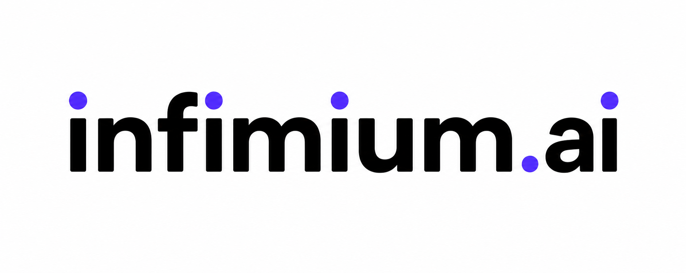
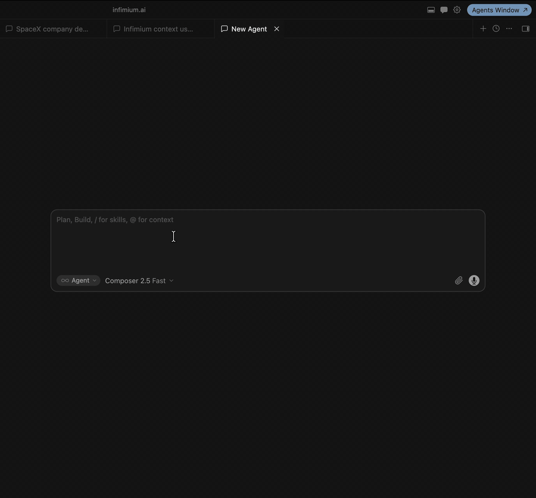

<p align="center">
  
</p>

# Infimium

The Private Context Layer & Super Brain for Your Codebase.
Give AI agents persistent memory, deep dependency graphs, and instant code context -- 100% local, zero token bloat.


[](https://www.npmjs.com/package/infimium)
[](https://lobehub.com/mcp/infimium-ai-infimium-agent)
[](LICENSE)
[](https://github.com/infimium-ai/infimium-agent)

## Demo

[](docs/assets/infimium-demo.mp4)

## Why

Large repositories make agents read too much code or miss the right symbol. Infimium retrieves compact, relevant context before the agent starts editing.

```text
200,000 lines of code
Agent reads everything -> context blown + expensive
grep "price calculation" -> misses calcPropertyValue()
```

```text
tool: semantic_code_search
query: "price calculation logic"

-> services/property/calc.ts:142 · calcPropertyValue()
-> callers: getListingPrice(), estimatePropertyTax()
```

## Quick Start

Requires Node.js 22.5+. From your project folder:

```bash
cd /path/to/your/project
npx infimium@latest setup
```

Run setup from the repository you want to index, not from your home directory (`~`).
Infimium stops broad roots automatically so it cannot scan unrelated files.

That creates global config, starts Ollama if it is installed, pulls `nomic-embed-text`, indexes the current project or workspace, runs `doctor`, and opens Playground.

The published CLI keeps its executable entrypoint, so MCP clients can launch it directly through the configuration below.

If Ollama is not installed yet:

```bash
npx infimium@latest setup --install-deps
```

`infimium setup` creates one global config at `~/.infimium/.env`. You do not need a `.env` in every project. Code, docs, memory, graphs, and vectors are stored locally under `~/.infimium/`.

Web search is optional. Add a Tinyfish key only when you need it:

```env
SEARCH_PROVIDER=tinyfish
SEARCH_API_KEY=your_key
```

Full `infimium plan` generation also needs a local text model:

```bash
ollama pull llama3.1
```

`infimium plan --dry-run "your task"` works without this model and shows the retrieved code context first.

## Connect Your Agent

Cursor, Windsurf, Claude Desktop, and other MCP clients:

```json
{
  "mcpServers": {
    "infimium": {
      "command": "npx",
      "args": ["-y", "infimium", "serve"]
    }
  }
}
```

Restart the client, then use:

```text
Use Infimium hello_infimium.
Use Infimium get_context before starting.
Use Infimium semantic_code_search to explain this repository.
```

Infimium normally uses the MCP process working directory. If your client starts it elsewhere, pass `project_path` once; Infimium remembers the active project and auto-indexes it.

## Tools

| Tool | What it does |
| --- | --- |
| `hello_infimium` | Confirms the MCP server is healthy. |
| `get_context` | Loads tri-zonal YAML context: stable repo anchors, live Git/index state, and active execution. |
| `semantic_code_search` | Finds code by meaning and returns symbol signatures first. |
| `expand_symbol` | Loads one full implementation only when needed. |
| `query_local_docs` | Searches local Markdown, text, HTML, and PDF files. |
| `dep_graph` | Shows imports, callers, callees, and HTTP routes for a symbol. |
| `project_memory` | Keeps active scratchpad events, compact milestones, and durable project rules across agents. |
| `plan` | Builds a grounded implementation plan from code and graph context. |
| `web_search` | Searches the web through optional Tinyfish configuration. |
| `fetch_url` | Extracts readable Markdown or text from a URL. |
| `shell` | Runs allowlisted commands with timeouts and output limits. |

## CLI

| Command | Description |
|---------|-------------|
| `infimium doctor` | Run health checks on your dependencies and setup. |
| `infimium status` | Show the current status of the index and memory. |
| `infimium --help` | Shows all relevant cli commands. |
| `infimium playground` | Launch the local web UI to explore index, graph, and memory. |
| `infimium index` | Scan and index the current project directory (code, docs, dependencies). |
| `infimium watch` | Run the indexer in watch mode to continuously index changes. |
| `infimium get-context` | Output the full flattened context as YAML (`layer.md`). |
| `infimium code-search <query>` | Semantically search code and return symbol signatures. |
| `infimium expand-symbol <symbol>` | Fetch the full implementation code for a specific symbol. |
| `infimium docs-search <query>` | Semantically search local markdown/text documentation. |
| `infimium dep-graph <symbol>` | Show dependencies, callers, callees, and route graph. |
| `infimium plan --dry-run "<task>"` | Draft an implementation plan based on a given prompt. |
| `infimium remember "<note>"` | Add a milestone, progress, or decision to project memory. |
| `infimium resume` | Show the active task and recent scratchpad memory events. |
| `infimium memory complete` | Compact the active scratchpad into an archived milestone. |
| `infimium memory search "<query>"` | Semantically search past project rules and memory ledger. |

Use `npx infimium ...` if you did not install the package globally.

## Project Memory

Infimium keeps memory bounded across long sessions:

- **Scratchpad:** recent events for the active task.
- **Archive:** compact summaries of completed tasks.
- **Ledger:** durable decisions, rules, quirks, and unresolved blockers.

Record meaningful progress while working:

```bash
infimium remember "Added rate-limit middleware" --type progress --task "Rate limiting"
infimium remember "Use Redis-backed counters in production" --type decision
```

When the task is complete:

```bash
infimium memory complete
```

Infimium uses the local `llama3.1` model when available and falls back to deterministic compaction when it is not. Raw compacted events remain stored locally for seven days before pruning. `get_context` never calls an LLM or network service.

From a source checkout, build once and run the local playground with:

```bash
npm run build
npm run playground
```

## Local Architecture

- Ollama creates embeddings on your machine.
- Embedded SQLite stores vectors, index metadata, project memory, and graph edges. No ChromaDB or Docker service is required.
- Documents use recursive boundary-aware chunks instead of blind fixed slices.
- JavaScript, TypeScript, Python, and Dart parsers are bundled.
- Go, Rust, and Java Tree-sitter WASM grammars download on first use and cache in `~/.infimium/grammars/`.
- `.gitignore`, `.infimiumignore`, and framework defaults exclude dependencies, build output, Flutter artifacts, caches, and binaries before indexing.
- `semantic_code_search` returns signatures; `expand_symbol` provides full code on demand.
- Project memory uses session-scoped scratchpads, compact milestone archives, and a versioned semantic ledger.
- `get_context` emits static anchors, dynamic repository state, and active execution as separate YAML zones.

## Multiple Projects

Run the normal index command from a folder containing related projects:

```bash
infimium index
```

Infimium detects immediate project roots from files such as `pubspec.yaml`, `package.json`, `Cargo.toml`, and `go.mod`. It shows the detected roles and dependencies, asks once, then creates `infimium.workspace.json`, indexes every project, and opens Playground.

For unattended setup:

```bash
infimium index --yes --no-playground
```

Use `--no-workspace` to index only the current project. Workspace projects keep separate memory and Git state while `get_context` includes balanced summaries and graph relationships from related projects.

## Infimium - Playground 

Infimium drops the initial payload cost from approximately **1,460 tokens to 8 tokens per symbol**. Semantic search returns the AST signature first; the agent requests the full implementation only when it needs it with `expand_symbol`.

```text
Full implementation   ~1,460 tokens
AST skeleton               ~8 tokens
Initial payload reduction  ~99.5%
```

These are Playground reference values, not a claim that every function has the same size. Inspect your own indexed repository and compare AST-first retrieval with full-text retrieval locally:

```bash
infimium playground
```

Open **Token Economics** to see the estimated token difference across your actual indexed symbols.
## Privacy

Code, docs, embeddings, memory, graph data, prompts, queries, file paths, and repo names remain local.

Infimium sends privacy-safe anonymous lifecycle telemetry so we can understand setup success:

- `init_started`, `init_completed`
- `doctor_run`, `doctor_passed`
- `index_started`, `index_completed`, `setup_completed`
- `serve_started`, `first_tool_call`, `playground_opened`

Telemetry includes an anonymous install ID, Infimium version, OS, Node major version, timestamp, and event name. It never includes code, file paths, repo names, prompts, search queries, memory notes, API keys, or user identity.

Disable it anytime:

```bash
infimium telemetry off
```

or set:

```env
INFIMIUM_TELEMETRY=false
```

## Troubleshooting

### FAQ & Common Confusions

**Where is `layer.md`?**
When you run `infimium get-context`, it intentionally prints the context directly to your terminal (`stdout`) so AI agents can read it instantly. It doesn't create a `layer.md` file in your workspace to avoid clutter. If you want to manually save it to a file, use terminal redirection:
```bash
infimium get-context > layer.md
```

**Why does the Playground UI say "Awaiting first agent interaction..."?**
The `CURRENT TASK` tracker at the top of the Playground UI is designed to mirror exactly what your AI agent sees. If an agent hasn't queried the context yet (via the `get-context` tool), it waits. To force it to update, manually run `infimium get-context`.

**How do I format `infimium remember`?**
The `infimium remember` command requires a message and a `--type` flag (valid types: `note`, `progress`, `decision`, `blocker`, `index`, `plan`). If you also want it to update the active task in the Playground, include the `--task` flag:
```bash
infimium remember "Added rate limiting" --type progress --task "Security Features"
```

### Database is locked

If you see `Failed to start Infimium: Database is locked`, it means another instance of Infimium is actively holding a lock on the SQLite memory database. This usually happens if you try to run `infimium index` manually in one terminal while `infimium playground` or `infimium watch` is still running in another. Simply stop the running process (Ctrl+C) before running manual commands.

### General Setup Issues

Run:

```bash
infimium doctor
```

Every failed check prints one copy-paste fix. If setup still fails, give this prompt to your coding agent:

```text
Set up Infimium in this repository. Install/start Ollama, pull nomic-embed-text,
run npx infimium init, run npx infimium index, and make all six
npx infimium doctor checks pass. Do not commit secrets.
```

## Contributing

See [CONTRIBUTING.md](CONTRIBUTING.md). Adding a language starts with a parser fixture and extraction test.

Self-hosting is free forever under the MIT license.
